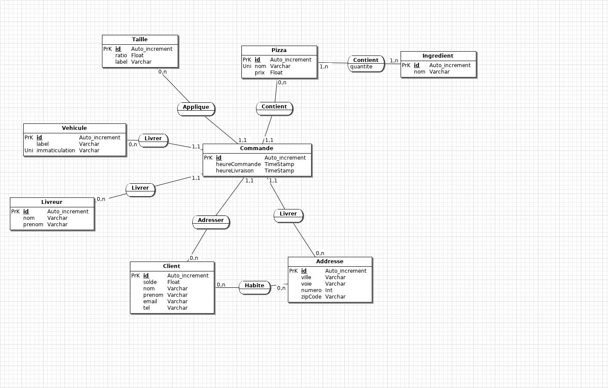

---
title: Rapport projet base de données - Rapizz
author: Romain Gille
        Erwan Maugere
date: \today
...

# Le projet et ses contraintes

## Description du projet
L'objectif principal visé par ce projet est la conception d'une base de données permettant de répondre aux besoins exprimés.
La base de données développée doit être capable de gérer l’activité quotidienne de vente et de livraison de Rapizz.
La base devra notamment vérifier le solde des comptes utilisateurs afin de refuser les commandes pour lesquels le solde est insuffisant.
La base doit aussi être capable de vérifier le montant de la facture pour ne pas facturer les pizzas gratuites grâce aux points de fidélité ou au retard.
De plus, la base doit pouvoir proposer un suivi du chiffre d’affaires des ventes des pizzas et effectuer des statistiques diverses sur les activités.

## Contraintes du projet
<CREEPYPASTA DU SUJET INCOMING>

## Technologies
* MariaDB FTW
* mysql-client
* JMerizzz
* eclipse & windowbuilder plugin & jdbc libs
* __DID I MENTION I USE ARCH LINUX ?__

# La base de données

## Schemas
Here you are:



## Détails

### Calcul du prix d'une pizza
Chaque pizza a un prix de base qui est estimé à partir de la liste des ingrédients et de la complexité de sa préparation. Ce prix est celui affiché sur la carte de la pizzeria.
Cependant, un second paramètre est à prendre en compte pour obtenir le prix réel d'une pizza. En effet, il est possible de commander des pizzas de tailles différentes,
la taille portera une influence sur le prix final de la pizza.
Rapizz propose aujourd'hui trois tailles de pizza: l'**humaine**, la **naine** et l'**ogresse**.
La taille dite "humaine" est à concidérer comme la taille normale et est proposée par défaut. Cette taille n'influe pas le prix finale de la pizza (ratio de 1).
A contrario, les tailles "naine" et "ogresse" influent le prix à hauteur respective d'une diminution et d'une augmentation d'un tier.
Pour appliquer ces changements de prix, la table `Taille` de notre base de données comporte un champ `ratio` qui représente l'influence de la taille sur le prix.
Dans la table `Commande`, une pizza est associée à sa taille. Il est ainsi possible d'obtenir le prix réel d'une pizza en appliquant le ratio de la taille sur le prix de base
de la pizza.
Cette oppération se fait grâce à la requête suivante:

```sql
SELECT
    p.prix AS "prix de base",
    t.ratio AS "ratio taille",
    p.prix*t.ratio AS "prix reel"
FROM Commande c
NATURAL JOIN Pizza p
NATURAL JOIN Taille t
WHERE c.id=2 -- id de commande
;
```

### Calcul du temps de livraison
Notre table `Commande` est composée de deux champs `heureCommande` et `heureLivraison` de type Timestamp qui représentent repectivement les dates et heures de commande et de
livraison.
Le champ `heureLivraison` est un champ qui peut être `null` ce qui permet de ne le saisir qu'après la livraison effective de la commande.

On peut alors, grâce à la requête suivante obtenir le temps de livraison d'une commande:

```sql
SELECT
    heureCommande,
    heureLivraison,
    heureCommande - heureLivraison AS "temps de livraison"
FROM Commande
WHERE id=1 -- id de commande
;
```

### Pizza de fidélite offerte
La pizzeria Rapizz a une offre de fidelité pour ses clients. Au bout de dix commandes, la pizza est offerte.

Pour vérifier si une commande doit être offerte, il faut suivre une procédure en deux étapes: calculer le nombre de commandes d'un client, puis, vérifier si la commande
est un chiffre rond.

Calcul du nombre de commandes par client:
```sql
SELECT
    clt.nom,
    COUNT(cmd.id_Client) AS "nb Commandes"
FROM Commande cmd
NATURAL JOIN Client clt
GROUP BY clt.nom;
```

Il nous suffit ensuite de faire un modulo $10$ et de vérifier si il vaut $0$.

### Adresse de clients et adresse de livraison
Un client a la possibilité de saisir différentes adresses de livraison. Cette fonctionnalité est incorporée à notre base de donnée par l'usage d'une table de liaison
entre les tables `Client` et `Adresse`.
Chaque commande doit aussi être liée à une adresse d'où la présence d'une clé étrangère `id_Adresse`.

## Procédures
cat scripts/procedures.sql scripts/requests.txt

# Interface graphique
I was thinking that maybe when you get back
You could come with me
Fuck work, fall in love right now
And spend all our money

Jump with me
OHOHOHOhoooo
Jump with me ohohohoo

I've been feeling it wasn't in my fingertips
When we tried it out
Get lost, get far away
And do what we want to do now

Jump with me
OHOHOHOhoooo
Jump with me ohohohoo

# Conclusion
Everything is new to me
Sleepless in a distant dream
Slowing up the speed of time
Don’t let me crash down tonight

I just want to feel
What I feel, what I feel
When it’s just you and me

I’m falling on my knees
On my knees, just to see
If I can still bleed

Cause with you I’m
Supeeeeeeeeeerhumaaaaaaaaaaaaan
Hope it’s not a
Grand delusiiiiiiion

So keep me in this state of miiiiiiiiiiind
Tell me that it's real lOO00000OOOve

Cause with you I’m
Supeeeeeeeeerhuumaaaaaaaaan

Suuupeeeeeeeeeeeerhuuumaaaaaaaan

# Annexes

Script de création de la base de donnée:
scripts/create.sql

Script d'insertion d'un jeu de données de test:
scripts/insert.sql

Procedures usuelles:
scripts/procedures.sql
