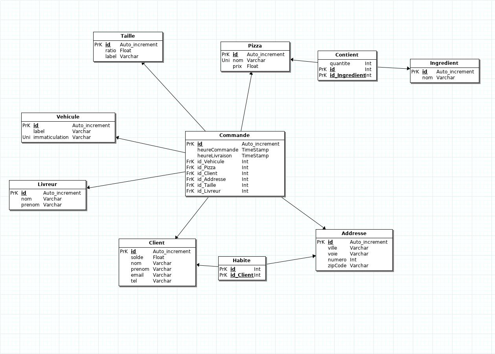

---
title: Rapport projet base de donnee - Rapizz
author: Romain Gille
        Erwan Maugere
date: \today
...

# Description du projet
<INSERT SOME BULLSHIT HERE>

# Contraintes

## Contraintes du projet
<CREEPYPASTA DU SUJET INCOMING>

## Technologies
* MariaDB FTW
* mysql-client
* JMerizzz
* eclipse & windowbuilder plugin & jcdb libs
* __DID I MENTION I USE ARCH LINUX__

# La base de donnee

## Schemas
Here you are:



## Details

### Calcul du prix d'une pizza
Chaque pizza a un prix de base qui est estimé à patir de la liste des ingrediants et de la complexité de sa préparation. Ce prix est celui affiché sur la carte de la pizzaria. Cependant, un second paramètre est à prendre en compte pour obtenir le prix réél d'une pizza. En effet, il est possible de commander des pizzas de taille différente, la taille portera une influence sur le prix finale de la pizza.
Rapizz propose aujourd'hui 3 tailles de pizza: l'humaine, la naine et l'ogresse.
La taille dites "humaine" est à concidéré comme la taille normale et est proposée par défaut. Cette taille n'influe pas le prix finale de la pizza. A contrario, les tailles "naine" et "ogresse" influent le prix à hauteur réspéctive d'une diminution et d'une augmentation d'un tier.
Pour appliquer ces changements de prix, la table Taille de notre base de donnée comporte un champ "ratio" qui représente l'influence de la taille sur le prix. Dans la table Commande, une pizza est associé à sa taille. Il est ainsi possible d'obtenir le réél d'une pizza en appliquant le ratio de la taille sur le prix de base de la pizza.
Cette oppération se fait grace à la requette suivante:
```sql
SELECT
    p.prix AS "prix de base",
    t.ratio AS "ratio taille",
    p.prix*t.ratio AS "prix reel"
FROM Commande c
NATURAL JOIN Pizza p
NATURAL JOIN Taille t
WHERE c.id=2 -- id de commande
;
```

### Calcul du temps de livraison
Notre table Commande est composé de deux champs "heureCommande" et "heureLivraison" de type timestamp qui représentent réspectivement les dates et heures de commande et de livraison.
Le champ heureLivraison est un champ nullable se qui permet de ne le saisir qu'après la livraison effective de la commande.

On peut alors, grace à la requete suivante obtenir le temps de livraison d'une commande:
```sql
SELECT
    heureCommande,
    heureLivraison,
    heureCommande - heureLivraison AS "temps de livraison"
FROM Commande
WHERE id=1 -- id de commande
;
```

### Pizza de fidelite offerte
La pizzaria Rapizz a une offre de fidelité pour ses clients. Au bout de 10 commandes, la pizza est offerte.

Pour vérifier si une commande doit être offerte, il faut suivre une procedure en deux étapes: calculer le nombre de commande d'un client puis, vérifier si la commande est un chiffre rond.

Calcul du nombre de commandes par client:
```sql
SELECT
    clt.nom,
    COUNT(cmd.id_Client) AS "nb Commandes"
FROM Commande cmd
NATURAL JOIN Client clt
GROUP BY clt.nom;
```

Il est ensuite plutot ultra assez ez de faire un fuckin' modulo 10 et check ça fait 0

### Taille de la pizza liee a la commande
[CF AU DESSUS](### Calcul du prix d'une pizza)

### Adresse de livraison
wut
SELECT id_Addresse FROM Commande ?
useless.com nan ?

## Procedures
cat scripts/procedures.sql scripts/requests.txt

# Interface graphique
I was thinking that maybe when you get back
You could come with me
Fuck work, fall in love right now
And spend all our money

Jump with me
OHOHOHOhoooo
Jump with me ohohohoo

I've been feeling it wasn't in my fingertips
When we tried it out
Get lost, get far away
And do what we want to do now

Jump with me
OHOHOHOhoooo
Jump with me ohohohoo

# Conclusion
Everything is new to me
Sleepless in a distant dream
Slowing up the speed of time
Don’t let me crash down tonight

I just want to feel
What I feel, what I feel
When it’s just you and me

I’m falling on my knees
On my knees, just to see
If I can still bleed

Cause with you I’m
Supeeeeeeeeeerhumaaaaaaaaaaaaan
Hope it’s not a
Grand delusiiiiiiion

So keep me in this state of miiiiiiiiiiind
Tell me that it's real lOO00000OOOve

Cause with you I’m
Supeeeeeeeeerhuumaaaaaaaaan

Suuupeeeeeeeeeeeerhuuumaaaaaaaan
